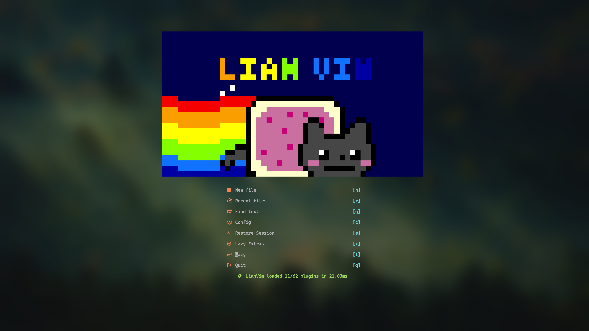

# ❄️ LianVim

> _forked from [lazyvim](https://www.lazyvim.org/)_

## Screenshot



## Install

```bash
# required
mv ~/.config/nvim{,.bak}

# optional but recommended
mv ~/.local/share/nvim{,.bak}
mv ~/.local/state/nvim{,.bak}
mv ~/.cache/nvim{,.bak}

# clone and start nvim
git clone https://github.com/AvavaAYA/LianVim.git ~/.config/nvim
nvim
```
